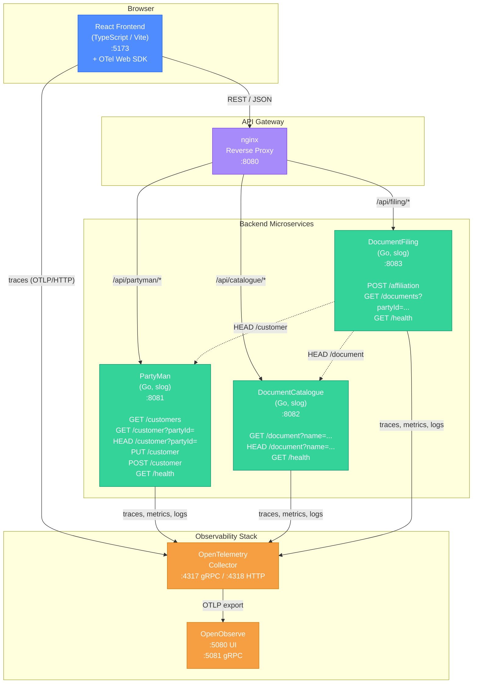
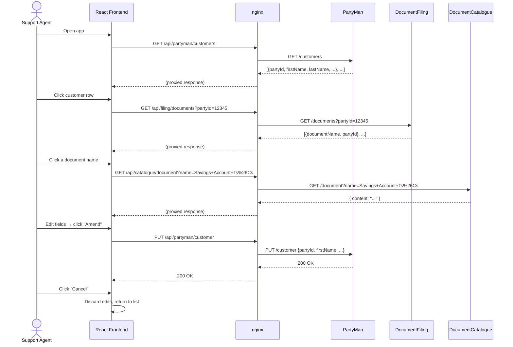
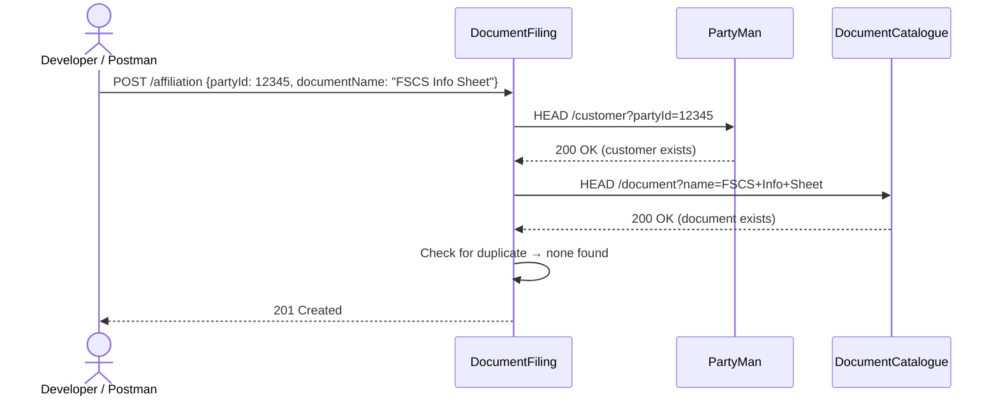

# A-Bank Customer & Document Management PoC — Architecture Plan

> **Author:** Principal Engineer  
> **Date:** 2026-02-20  
> **Status:** APPROVED — updated with review feedback (v2)

---

## 1. Architecture Diagram



### Component-Interaction Sequence (customer-details view)



### Affiliation Sequence (via curl / Postman — not in frontend UI)



---

## 2. Component Details

### 2.1 PartyMan (Go, port 8081)

| Endpoint                 | Method | Description                                                                     |
| ------------------------ | ------ | ------------------------------------------------------------------------------- |
| `/customers`             | GET    | Returns all customer records                                                    |
| `/customer?partyId=<id>` | GET    | Returns a single customer by PartyID                                            |
| `/customer?partyId=<id>` | HEAD   | Validates that a customer exists (200 or 404, no body) — used by DocumentFiling |
| `/customer`              | POST   | Creates a new customer (auto-assigns next PartyID); validates required fields   |
| `/customer`              | PUT    | Updates an existing customer by PartyID; validates required fields              |
| `/health`                | GET    | Health-check endpoint → `200 OK`                                                |

**Data model (`customer`):**

```json
{
    "partyId": 12345,
    "firstName": "Jane",
    "lastName": "Doe",
    "addressLine1": "10 Downing Street",
    "addressLine2": "",
    "city": "London",
    "postcode": "SW1A 2AA",
    "country": "United Kingdom"
}
```

- Initial data: 5 records loaded from `data/customers.json` at startup.
- Runtime mutations stored in-memory (Go map, protected by `sync.RWMutex`).
- **Validation:** POST and PUT require at minimum `firstName` and `lastName`; PUT additionally requires `partyId`. Missing fields return `400 Bad Request`.
- **Structured logging:** All handlers log via `slog` with JSON output.

### 2.2 DocumentCatalogue (Go, port 8082)

| Endpoint                   | Method | Description                                                                     |
| -------------------------- | ------ | ------------------------------------------------------------------------------- |
| `/document?name=<docName>` | GET    | Returns the full text of the named document                                     |
| `/document?name=<docName>` | HEAD   | Validates that a document exists (200 or 404, no body) — used by DocumentFiling |
| `/health`                  | GET    | Health-check endpoint → `200 OK`                                                |

**Stored documents (plain `.txt` files in `data/`):**

| File                   | Document name         |
| ---------------------- | --------------------- |
| `customer-tsandcs.txt` | A-Bank customer Ts&Cs |
| `savings-tsandcs.txt`  | Savings Account Ts&Cs |
| `fscs-info.txt`        | FSCS Info Sheet       |

Returns 404 if the document name is not recognised.

**Structured logging:** All handlers log via `slog` with JSON output.

### 2.3 DocumentFiling (Go, port 8083)

| Endpoint                  | Method | Description                                                  |
| ------------------------- | ------ | ------------------------------------------------------------ |
| `/affiliation`            | POST   | Creates an association `{partyId, documentName}`             |
| `/documents?partyId=<id>` | GET    | Returns all document names affiliated with the given PartyID |
| `/health`                 | GET    | Health-check endpoint → `200 OK`                             |

- Affiliations held in-memory (`map[int][]string`).
- **Duplicate prevention:** Before inserting, checks whether the `{partyId, documentName}` pair already exists. Returns `409 Conflict` if so.
- **Cross-service validation on POST /affiliation:**
    1. Calls `HEAD /customer?partyId=<id>` on **PartyMan** to confirm the customer exists (expects 200; returns 422 if 404).
    2. Calls `HEAD /document?name=<name>` on **DocumentCatalogue** to confirm the document name is valid (expects 200; returns 422 if 404).
    3. Only creates the affiliation if both checks pass.
- Service-to-service calls use internal Docker network hostnames (e.g., `http://partyman:8081`).
- **Structured logging:** All handlers log via `slog` with JSON output.

### 2.4 React Frontend (TypeScript / Vite, port 5173)

| View                | Description                                                                                                                                      |
| ------------------- | ------------------------------------------------------------------------------------------------------------------------------------------------ |
| **Customer List**   | Table showing all customers. Click a row to navigate to details.                                                                                 |
| **Customer Detail** | Editable form for name + address fields. Read-only list of affiliated documents below. **Amend** saves via `PUT /customer`; **Cancel** discards. |
| **Document Viewer** | Read-only text panel that appears inline when a document name is clicked.                                                                        |

- All API calls go via the nginx reverse proxy at a single origin (`/api/...`).
- **No affiliation creation UI** — affiliations are created ad-hoc via curl/Postman (in the real system this happens in the customer journey via the bank's mobile app).
- **OTel Web SDK** — the frontend will be instrumented with `@opentelemetry/sdk-trace-web` to send browser-side traces to the OTel Collector via OTLP/HTTP.

### 2.5 API Gateway — nginx Reverse Proxy (port 8080)

A single nginx container provides a unified entry point for the browser, eliminating CORS issues:

| Route              | Upstream                    |
| ------------------ | --------------------------- |
| `/`                | Frontend (`:5173`)          |
| `/api/partyman/*`  | PartyMan (`:8081`)          |
| `/api/catalogue/*` | DocumentCatalogue (`:8082`) |
| `/api/filing/*`    | DocumentFiling (`:8083`)    |

### 2.6 Observability Stack

| Component                   | Image                                  | Purpose                                                           |
| --------------------------- | -------------------------------------- | ----------------------------------------------------------------- |
| **OpenTelemetry Collector** | `otel/opentelemetry-collector-contrib` | Receives OTLP from Go services + frontend, exports to OpenObserve |
| **OpenObserve**             | `public.ecr.aws/zinclabs/openobserve`  | Stores and visualises logs, traces, metrics                       |

- All three Go services instrumented with the **OpenTelemetry Go SDK** (`go.opentelemetry.io/otel`).
- The React frontend instrumented with **`@opentelemetry/sdk-trace-web`** for browser-side traces.
- All Go services use **`slog`** (Go 1.21+) with **JSON structured logging** to stdout. The OTel Collector's Docker log driver or `filelog` receiver forwards these to OpenObserve.
- Each service exports traces (and optionally metrics + logs) via OTLP gRPC to the Collector.
- The Collector forwards to OpenObserve's OTLP endpoints.

---

## 3. Repository Layout

```
openobserve-poc/
├── docker-compose.yml              # Orchestrates all containers
├── docs/
│   └── architecture-plan.md        # This document
│
├── services/
│   ├── partyman/
│   │   ├── Dockerfile
│   │   ├── go.mod / go.sum
│   │   ├── main.go
│   │   ├── handlers/
│   │   ├── models/
│   │   ├── telemetry/              # OTel bootstrap
│   │   └── data/
│   │       └── customers.json
│   │
│   ├── documentcatalogue/
│   │   ├── Dockerfile
│   │   ├── go.mod / go.sum
│   │   ├── main.go
│   │   ├── handlers/
│   │   ├── telemetry/
│   │   └── data/
│   │       ├── customer-tsandcs.txt
│   │       ├── savings-tsandcs.txt
│   │       └── fscs-info.txt
│   │
│   └── documentfiling/
│       ├── Dockerfile
│       ├── go.mod / go.sum
│       ├── main.go
│       ├── handlers/
│       │   └── validation.go       # HEAD calls to PartyMan + DocumentCatalogue
│       ├── models/
│       └── telemetry/
│
├── frontend/
│   ├── Dockerfile
│   ├── package.json
│   ├── tsconfig.json
│   ├── vite.config.ts
│   ├── index.html
│   └── src/
│       ├── main.tsx
│       ├── App.tsx
│       ├── api/                    # Service client functions
│       ├── telemetry/              # OTel Web SDK bootstrap
│       ├── components/
│       │   ├── CustomerList.tsx
│       │   ├── CustomerDetail.tsx
│       │   └── DocumentViewer.tsx
│       └── styles/
│           └── index.css
│
├── nginx/
│   └── nginx.conf                  # Reverse proxy routing config
│
└── observability/
    └── otel-collector-config.yaml  # Collector pipeline config
```

---

## 4. Task Breakdown

### Phase 0 — Project Scaffolding

| #   | Task                                                                               | Est.   |
| --- | ---------------------------------------------------------------------------------- | ------ |
| 0.1 | Create repo layout (`services/`, `frontend/`, `nginx/`, `observability/`, `docs/`) | 15 min |
| 0.2 | Create `docker-compose.yml` with all service stubs + nginx + networking            | 30 min |
| 0.3 | Write nginx reverse-proxy config (`nginx/nginx.conf`)                              | 15 min |
| 0.4 | Write OTel Collector config (`otel-collector-config.yaml`)                         | 20 min |
| 0.5 | Update `.gitignore` for Go, Node, and Docker artefacts                             | 10 min |

### Phase 1 — PartyMan Service

| #    | Task                                                                             | Est.   |
| ---- | -------------------------------------------------------------------------------- | ------ |
| 1.1  | Initialise Go module, create data model and `customers.json` seed file           | 20 min |
| 1.2  | Implement in-memory store with JSON-file bootstrap and `sync.RWMutex`            | 20 min |
| 1.3  | Implement `GET /customers` handler                                               | 15 min |
| 1.4  | Implement `GET /customer?partyId=` handler (single customer)                     | 10 min |
| 1.5  | Implement `HEAD /customer?partyId=` handler (existence check)                    | 10 min |
| 1.6  | Implement `POST /customer` handler (auto-increment PartyID) + payload validation | 15 min |
| 1.7  | Implement `PUT /customer` handler (update by PartyID) + payload validation       | 15 min |
| 1.8  | Add `GET /health` endpoint                                                       | 5 min  |
| 1.9  | Set up `slog` JSON structured logging                                            | 10 min |
| 1.10 | Add OTel instrumentation (tracing + basic HTTP metrics)                          | 30 min |
| 1.11 | Write Dockerfile                                                                 | 10 min |
| 1.12 | Smoke-test with `curl`                                                           | 10 min |

### Phase 2 — DocumentCatalogue Service

| #   | Task                                                       | Est.   |
| --- | ---------------------------------------------------------- | ------ |
| 2.1 | Initialise Go module, create three `.txt` document files   | 20 min |
| 2.2 | Implement `GET /document?name=` handler with file lookup   | 20 min |
| 2.3 | Implement `HEAD /document?name=` handler (existence check) | 10 min |
| 2.4 | Add `GET /health` endpoint                                 | 5 min  |
| 2.5 | Set up `slog` JSON structured logging                      | 10 min |
| 2.6 | Add OTel instrumentation                                   | 25 min |
| 2.7 | Write Dockerfile                                           | 10 min |

### Phase 3 — DocumentFiling Service

| #   | Task                                                                                     | Est.   |
| --- | ---------------------------------------------------------------------------------------- | ------ |
| 3.1 | Initialise Go module, define affiliation data model                                      | 15 min |
| 3.2 | Implement cross-service validation helper (`HEAD` calls to PartyMan + DocumentCatalogue) | 20 min |
| 3.3 | Implement `POST /affiliation` handler with validation + duplicate check                  | 20 min |
| 3.4 | Implement `GET /documents?partyId=` handler                                              | 15 min |
| 3.5 | Add `GET /health` endpoint                                                               | 5 min  |
| 3.6 | Set up `slog` JSON structured logging                                                    | 10 min |
| 3.7 | Add OTel instrumentation                                                                 | 25 min |
| 3.8 | Write Dockerfile                                                                         | 10 min |

### Phase 4 — React Frontend

| #   | Task                                                                    | Est.   |
| --- | ----------------------------------------------------------------------- | ------ |
| 4.1 | Scaffold Vite + React + TypeScript project                              | 15 min |
| 4.2 | Implement API client layer (`api/`) — all calls via `/api/...`          | 20 min |
| 4.3 | Build `CustomerList` component (table, click-to-select)                 | 30 min |
| 4.4 | Build `CustomerDetail` component (editable form + Amend/Cancel)         | 40 min |
| 4.5 | Build `DocumentViewer` component (read-only text panel)                 | 20 min |
| 4.6 | Wire up routing / navigation between list ↔ detail                      | 20 min |
| 4.7 | Styling & polish (premium dark theme, responsive)                       | 40 min |
| 4.8 | Set up OTel Web SDK (`@opentelemetry/sdk-trace-web`) + OTLP/HTTP export | 25 min |
| 4.9 | Write Dockerfile (multi-stage: build → nginx)                           | 15 min |

### Phase 5 — Observability & Integration

| #   | Task                                                                | Est.   |
| --- | ------------------------------------------------------------------- | ------ |
| 5.1 | Configure OpenObserve container in `docker-compose.yml`             | 15 min |
| 5.2 | Configure OTel Collector container + pipeline config                | 20 min |
| 5.3 | Verify traces appear in OpenObserve UI                              | 20 min |
| 5.4 | (Optional) Add a pre-built dashboard or saved search in OpenObserve | 20 min |

### Phase 6 — End-to-End Validation

| #   | Task                                                                                  | Est.   |
| --- | ------------------------------------------------------------------------------------- | ------ |
| 6.1 | `docker compose up` — verify all containers start cleanly                             | 15 min |
| 6.2 | Walk through the full user journey in the browser                                     | 15 min |
| 6.3 | Verify telemetry end-to-end (trace from frontend call → service → OTel → OpenObserve) | 20 min |
| 6.4 | Write a brief `README.md` with setup & usage instructions                             | 20 min |

**Estimated total: ~12–14 hours** (solo developer, including learning-curve allowance for OTel/OpenObserve)

---

## 5. Resolved Gaps & Design Decisions

### 5.1 Functional Gaps

| #   | Gap                                    | Resolution                                                                                                         |
| --- | -------------------------------------- | ------------------------------------------------------------------------------------------------------------------ |
| G1  | **No validation on PUT/POST payloads** | ✅ **Added.** Minimal validation: require `firstName`, `lastName`, and `partyId` (for PUT). Return 400 on missing. |
| G2  | **Duplicate affiliation prevention**   | ✅ **Added.** Duplicate check in in-memory store; return 409 Conflict if affiliation already exists.               |
| G3  | **No affiliation UI in the frontend**  | ✅ **Intentionally excluded.** Affiliations created ad-hoc via curl/Postman (mirrors real-world mobile app flow).  |
| G4  | **No DELETE endpoints**                | ✅ **Intentionally omitted** for PoC scope. Documented as known limitation.                                        |
| G5  | **PUT vs PATCH semantics**             | ✅ **PUT with full replacement only.** Frontend always sends the complete customer object.                         |
| G6  | **No authentication/authorisation**    | ✅ **Out of scope** for PoC. Noted in README.                                                                      |

### 5.2 Technical Gaps

| #   | Gap                                           | Resolution                                                                                                                                               |
| --- | --------------------------------------------- | -------------------------------------------------------------------------------------------------------------------------------------------------------- |
| T1  | **CORS configuration**                        | ✅ **Resolved by nginx reverse proxy.** Single origin eliminates CORS concerns entirely.                                                                 |
| T2  | **Service discovery in frontend**             | ✅ **Resolved by nginx reverse proxy.** Frontend uses relative `/api/...` paths — no env vars needed.                                                    |
| T3  | **DocumentFiling doesn't validate party/doc** | ✅ **Added.** `HEAD /customer` and `HEAD /document` endpoints for lightweight existence checks; DocumentFiling calls these before creating affiliations. |
| T4  | **No health-check endpoints**                 | ✅ **Added.** `GET /health` → 200 on all three services.                                                                                                 |
| T5  | **Frontend OTel instrumentation**             | ✅ **Added.** `@opentelemetry/sdk-trace-web` with OTLP/HTTP export to the Collector.                                                                     |
| T6  | **Structured logging**                        | ✅ **Added.** All Go services use `slog` with JSON output to stdout.                                                                                     |

### 5.3 API Gateway / Reverse Proxy ✅

nginx container added to `docker-compose.yml` as a single entry point:

```
Browser → nginx (:8080)
             ├── /                   → frontend (:5173)
             ├── /api/partyman/      → PartyMan (:8081)
             ├── /api/catalogue/     → DocumentCatalogue (:8082)
             └── /api/filing/        → DocumentFiling (:8083)
```

This eliminates all CORS issues and gives the frontend a single origin to call.

---

## 6. Technology Choices Summary

| Concern                | Choice                                                  | Rationale                                     |
| ---------------------- | ------------------------------------------------------- | --------------------------------------------- |
| Go HTTP framework      | `net/http` (stdlib)                                     | No external dependency; sufficient for PoC    |
| Go router              | `net/http` (Go 1.22+ enhanced routing) or `gorilla/mux` | Native pattern matching is adequate           |
| Go structured logging  | `log/slog` (stdlib, Go 1.21+)                           | JSON output, zero dependencies                |
| Frontend framework     | React 19 + TypeScript                                   | Per spec                                      |
| Frontend build tool    | Vite                                                    | Fast, modern, lightweight                     |
| Frontend telemetry     | `@opentelemetry/sdk-trace-web` + OTLP/HTTP exporter     | Browser-side traces to OTel Collector         |
| API gateway            | nginx (Docker)                                          | Reverse proxy; eliminates CORS; single origin |
| Containerisation       | Docker + Docker Compose                                 | Standard local dev stack                      |
| Telemetry SDK (Go)     | `go.opentelemetry.io/otel` + `otlpgrpc` exporter        | Official Go OTel SDK                          |
| Observability platform | OpenObserve (single-binary)                             | Per spec; lightweight, OTLP-native            |
| OTel Collector         | `otel/opentelemetry-collector-contrib`                  | Supports OTLP in + OTLP out to OpenObserve    |

---

## 7. Next Steps

All gaps reviewed and decisions incorporated (v2). Ready to proceed:

1. **Approve** → Implementation begins at Phase 0.
2. Implementation order: Phase 0 (scaffolding) → Phase 1–3 (services, parallelisable) → Phase 4 (frontend) → Phase 5–6 (observability & E2E validation).
