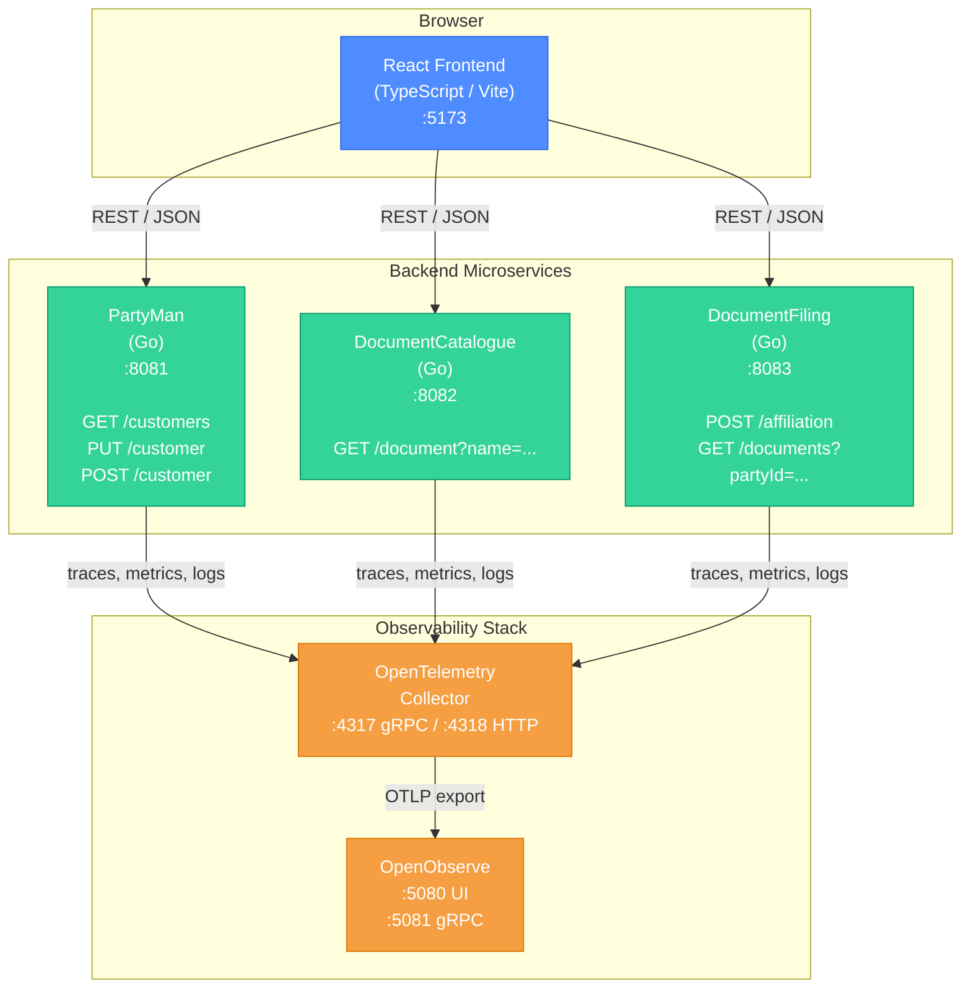
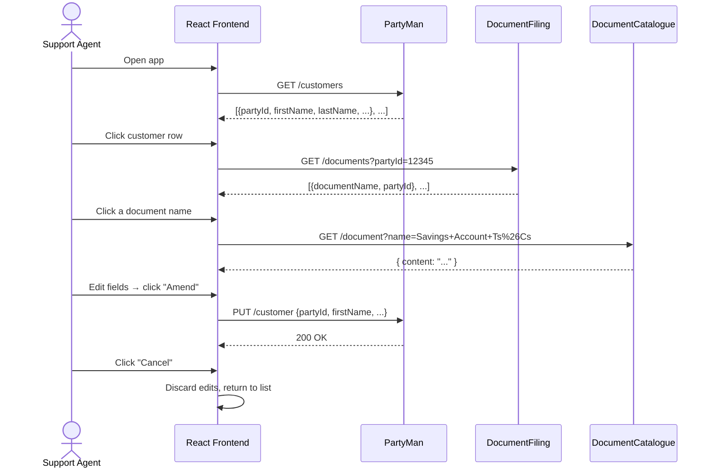

# A-Bank Customer & Document Management PoC — Architecture Plan

> **Author:** Principal Engineer  
> **Date:** 2026-02-20  
> **Status:** DRAFT — awaiting review

---

## 1. Architecture Diagram



### Component-Interaction Sequence (customer-details view)



---

## 2. Component Details

### 2.1 PartyMan (Go, port 8081)

| Endpoint     | Method | Description                                        |
| ------------ | ------ | -------------------------------------------------- |
| `/customers` | GET    | Returns all customer records                       |
| `/customer`  | POST   | Creates a new customer (auto-assigns next PartyID) |
| `/customer`  | PUT    | Updates an existing customer by PartyID            |

**Data model (`customer`):**

```json
{
    "partyId": 12345,
    "firstName": "Jane",
    "lastName": "Doe",
    "addressLine1": "10 Downing Street",
    "addressLine2": "",
    "city": "London",
    "postcode": "SW1A 2AA",
    "country": "United Kingdom"
}
```

- Initial data: 5 records loaded from `data/customers.json` at startup.
- Runtime mutations stored in-memory (Go map, protected by `sync.RWMutex`).

### 2.2 DocumentCatalogue (Go, port 8082)

| Endpoint                   | Method | Description                                 |
| -------------------------- | ------ | ------------------------------------------- |
| `/document?name=<docName>` | GET    | Returns the full text of the named document |

**Stored documents (plain `.txt` files in `data/`):**

| File                   | Document name         |
| ---------------------- | --------------------- |
| `customer-tsandcs.txt` | A-Bank customer Ts&Cs |
| `savings-tsandcs.txt`  | Savings Account Ts&Cs |
| `fscs-info.txt`        | FSCS Info Sheet       |

Returns 404 if the document name is not recognised.

### 2.3 DocumentFiling (Go, port 8083)

| Endpoint                  | Method | Description                                                  |
| ------------------------- | ------ | ------------------------------------------------------------ |
| `/affiliation`            | POST   | Creates an association `{partyId, documentName}`             |
| `/documents?partyId=<id>` | GET    | Returns all document names affiliated with the given PartyID |

- Affiliations held in-memory (`map[int][]string`).
- No deduplication enforced (same doc can be affiliated more than once unless we add a guard — see **Gaps**).

### 2.4 React Frontend (TypeScript / Vite, port 5173)

| View                | Description                                                                                                                                      |
| ------------------- | ------------------------------------------------------------------------------------------------------------------------------------------------ |
| **Customer List**   | Table showing all customers. Click a row to navigate to details.                                                                                 |
| **Customer Detail** | Editable form for name + address fields. Read-only list of affiliated documents below. **Amend** saves via `PUT /customer`; **Cancel** discards. |
| **Document Viewer** | Read-only text panel that appears inline when a document name is clicked.                                                                        |

### 2.5 Observability Stack

| Component                   | Image                                  | Purpose                                                |
| --------------------------- | -------------------------------------- | ------------------------------------------------------ |
| **OpenTelemetry Collector** | `otel/opentelemetry-collector-contrib` | Receives OTLP from Go services, exports to OpenObserve |
| **OpenObserve**             | `public.ecr.aws/zinclabs/openobserve`  | Stores and visualises logs, traces, metrics            |

- All three Go services will be instrumented with the **OpenTelemetry Go SDK** (`go.opentelemetry.io/otel`).
- Each service exports traces (and optionally metrics + logs) via OTLP gRPC to the Collector.
- The Collector forwards to OpenObserve's OTLP endpoints.

---

## 3. Repository Layout

```
openobserve-poc/
├── docker-compose.yml              # Orchestrates all containers
├── docs/
│   └── architecture-plan.md        # This document
│
├── services/
│   ├── partyman/
│   │   ├── Dockerfile
│   │   ├── go.mod / go.sum
│   │   ├── main.go
│   │   ├── handlers/
│   │   ├── models/
│   │   ├── telemetry/              # OTel bootstrap
│   │   └── data/
│   │       └── customers.json
│   │
│   ├── documentcatalogue/
│   │   ├── Dockerfile
│   │   ├── go.mod / go.sum
│   │   ├── main.go
│   │   ├── handlers/
│   │   ├── telemetry/
│   │   └── data/
│   │       ├── customer-tsandcs.txt
│   │       ├── savings-tsandcs.txt
│   │       └── fscs-info.txt
│   │
│   └── documentfiling/
│       ├── Dockerfile
│       ├── go.mod / go.sum
│       ├── main.go
│       ├── handlers/
│       ├── models/
│       └── telemetry/
│
├── frontend/
│   ├── Dockerfile
│   ├── package.json
│   ├── tsconfig.json
│   ├── vite.config.ts
│   ├── index.html
│   └── src/
│       ├── main.tsx
│       ├── App.tsx
│       ├── api/                    # Service client functions
│       ├── components/
│       │   ├── CustomerList.tsx
│       │   ├── CustomerDetail.tsx
│       │   └── DocumentViewer.tsx
│       └── styles/
│           └── index.css
│
└── observability/
    └── otel-collector-config.yaml  # Collector pipeline config
```

---

## 4. Task Breakdown

### Phase 0 — Project Scaffolding

| #   | Task                                                                     | Est.   |
| --- | ------------------------------------------------------------------------ | ------ |
| 0.1 | Create repo layout (`services/`, `frontend/`, `observability/`, `docs/`) | 15 min |
| 0.2 | Create `docker-compose.yml` with all service stubs + networking          | 30 min |
| 0.3 | Write OTel Collector config (`otel-collector-config.yaml`)               | 20 min |
| 0.4 | Update `.gitignore` for Go, Node, and Docker artefacts                   | 10 min |

### Phase 1 — PartyMan Service

| #   | Task                                                                   | Est.   |
| --- | ---------------------------------------------------------------------- | ------ |
| 1.1 | Initialise Go module, create data model and `customers.json` seed file | 20 min |
| 1.2 | Implement in-memory store with JSON-file bootstrap and `sync.RWMutex`  | 20 min |
| 1.3 | Implement `GET /customers` handler                                     | 15 min |
| 1.4 | Implement `POST /customer` handler (auto-increment PartyID)            | 15 min |
| 1.5 | Implement `PUT /customer` handler (update by PartyID)                  | 15 min |
| 1.6 | Add CORS middleware                                                    | 10 min |
| 1.7 | Add OTel instrumentation (tracing + basic HTTP metrics)                | 30 min |
| 1.8 | Write Dockerfile                                                       | 10 min |
| 1.9 | Smoke-test with `curl`                                                 | 10 min |

### Phase 2 — DocumentCatalogue Service

| #   | Task                                                     | Est.   |
| --- | -------------------------------------------------------- | ------ |
| 2.1 | Initialise Go module, create three `.txt` document files | 20 min |
| 2.2 | Implement `GET /document?name=` handler with file lookup | 20 min |
| 2.3 | Add CORS middleware                                      | 10 min |
| 2.4 | Add OTel instrumentation                                 | 25 min |
| 2.5 | Write Dockerfile                                         | 10 min |

### Phase 3 — DocumentFiling Service

| #   | Task                                                | Est.   |
| --- | --------------------------------------------------- | ------ |
| 3.1 | Initialise Go module, define affiliation data model | 15 min |
| 3.2 | Implement `POST /affiliation` handler               | 15 min |
| 3.3 | Implement `GET /documents?partyId=` handler         | 15 min |
| 3.4 | Add CORS middleware                                 | 10 min |
| 3.5 | Add OTel instrumentation                            | 25 min |
| 3.6 | Write Dockerfile                                    | 10 min |

### Phase 4 — React Frontend

| #   | Task                                                            | Est.   |
| --- | --------------------------------------------------------------- | ------ |
| 4.1 | Scaffold Vite + React + TypeScript project                      | 15 min |
| 4.2 | Implement API client layer (`api/`)                             | 20 min |
| 4.3 | Build `CustomerList` component (table, click-to-select)         | 30 min |
| 4.4 | Build `CustomerDetail` component (editable form + Amend/Cancel) | 40 min |
| 4.5 | Build `DocumentViewer` component (read-only text panel)         | 20 min |
| 4.6 | Wire up routing / navigation between list ↔ detail              | 20 min |
| 4.7 | Styling & polish (premium dark theme, responsive)               | 40 min |
| 4.8 | Write Dockerfile (multi-stage: build → nginx)                   | 15 min |

### Phase 5 — Observability & Integration

| #   | Task                                                                | Est.   |
| --- | ------------------------------------------------------------------- | ------ |
| 5.1 | Configure OpenObserve container in `docker-compose.yml`             | 15 min |
| 5.2 | Configure OTel Collector container + pipeline config                | 20 min |
| 5.3 | Verify traces appear in OpenObserve UI                              | 20 min |
| 5.4 | (Optional) Add a pre-built dashboard or saved search in OpenObserve | 20 min |

### Phase 6 — End-to-End Validation

| #   | Task                                                                                  | Est.   |
| --- | ------------------------------------------------------------------------------------- | ------ |
| 6.1 | `docker compose up` — verify all containers start cleanly                             | 15 min |
| 6.2 | Walk through the full user journey in the browser                                     | 15 min |
| 6.3 | Verify telemetry end-to-end (trace from frontend call → service → OTel → OpenObserve) | 20 min |
| 6.4 | Write a brief `README.md` with setup & usage instructions                             | 20 min |

**Estimated total: ~10–12 hours** (solo developer, including learning-curve allowance for OTel/OpenObserve)

---

## 5. Identified Gaps & Open Questions

### 5.1 Functional Gaps

| #   | Gap                                                                                                                                                      | Severity  | Recommendation                                                                                                                                                               |
| --- | -------------------------------------------------------------------------------------------------------------------------------------------------------- | --------- | ---------------------------------------------------------------------------------------------------------------------------------------------------------------------------- |
| G1  | **No validation on PUT/POST payloads** — the spec doesn't mention validation rules for customer fields.                                                  | Low (PoC) | Implement minimal validation: require `firstName`, `lastName`, and `partyId` (for PUT). Return 400 on missing fields.                                                        |
| G2  | **Duplicate affiliation prevention** — `POST /affiliation` could affiliate the same document to the same party multiple times.                           | Low       | Add a simple duplicate check in the in-memory store; return 409 Conflict if the affiliation already exists.                                                                  |
| G3  | **No affiliation UI in the frontend spec** — the spec says the frontend shows affiliated docs, but doesn't describe how a user _creates_ an affiliation. | Medium    | **Decision needed:** Should the frontend include an "Affiliate Document" action (e.g., a dropdown on the detail page), or is affiliation only done via API/curl for the PoC? |
| G4  | **No DELETE endpoints** — customers and affiliations cannot be removed.                                                                                  | Low (PoC) | Intentionally omitted for PoC scope. Document as a known limitation.                                                                                                         |
| G5  | **PartyMan PUT vs PATCH semantics** — PUT implies full replacement; should partial updates be supported?                                                 | Low       | Use PUT with full-object semantics for simplicity. Frontend always sends the complete customer object.                                                                       |
| G6  | **No authentication/authorisation** — appropriate for a PoC, but worth calling out.                                                                      | Low (PoC) | Out of scope. Note in README.                                                                                                                                                |

### 5.2 Technical Gaps

| #   | Gap                                                                                                                                                                   | Severity  | Recommendation                                                                                                                                                                                                                                                                                      |
| --- | --------------------------------------------------------------------------------------------------------------------------------------------------------------------- | --------- | --------------------------------------------------------------------------------------------------------------------------------------------------------------------------------------------------------------------------------------------------------------------------------------------------- |
| T1  | **CORS configuration** — the frontend (`:5173`) needs to call three different service origins.                                                                        | High      | Each Go service must include CORS middleware allowing the frontend origin. Alternatively, add an **nginx reverse-proxy / API gateway** in `docker-compose.yml` that routes `/api/partyman/*`, `/api/docs/*`, `/api/filing/*` to the respective services — this also simplifies the frontend config. |
| T2  | **Service discovery in frontend** — the React app needs to know the URL of each backend service.                                                                      | Medium    | Use environment variables (`VITE_PARTYMAN_URL`, etc.) injected at build time, or use the reverse-proxy approach from T1 which gives a single base URL. **The reverse-proxy approach is strongly recommended.**                                                                                      |
| T3  | **DocumentFiling doesn't validate against PartyMan or DocumentCatalogue** — you can affiliate a non-existent PartyID or document name.                                | Low (PoC) | Accept for PoC. In production, DocumentFiling would call PartyMan and DocumentCatalogue to validate.                                                                                                                                                                                                |
| T4  | **No health-check endpoints** — Docker/orchestrator can't verify readiness.                                                                                           | Low       | Add a simple `GET /health` → `200 OK` on each service. Minimal effort, good practice.                                                                                                                                                                                                               |
| T5  | **Frontend OTel instrumentation** — spec mentions OTel for services but not the frontend.                                                                             | Low       | Out of scope for PoC. Could add `@opentelemetry/sdk-trace-web` later for browser-side traces.                                                                                                                                                                                                       |
| T6  | **Structured logging** — should Go services log to stdout in JSON (structured) format for the OTel Collector to pick up, or rely solely on trace-based observability? | Medium    | Use `slog` (Go 1.21+ structured logger) with JSON output. The OTel Collector's `filelog` receiver or Docker log driver can forward these to OpenObserve.                                                                                                                                            |

### 5.3 Recommended Addition: API Gateway / Reverse Proxy

To address **T1** and **T2** cleanly, I recommend adding an **nginx** container to `docker-compose.yml` that acts as a single entry point:

```
Browser → nginx (:8080)
             ├── /                   → frontend (:5173)
             ├── /api/partyman/      → PartyMan (:8081)
             ├── /api/catalogue/     → DocumentCatalogue (:8082)
             └── /api/filing/        → DocumentFiling (:8083)
```

This eliminates all CORS issues and gives the frontend a single origin to call. **Shall I include this in the plan?**

---

## 6. Technology Choices Summary

| Concern                | Choice                                                  | Rationale                                  |
| ---------------------- | ------------------------------------------------------- | ------------------------------------------ |
| Go HTTP framework      | `net/http` (stdlib)                                     | No external dependency; sufficient for PoC |
| Go router              | `net/http` (Go 1.22+ enhanced routing) or `gorilla/mux` | Native pattern matching is adequate        |
| Frontend framework     | React 19 + TypeScript                                   | Per spec                                   |
| Frontend build tool    | Vite                                                    | Fast, modern, lightweight                  |
| Containerisation       | Docker + Docker Compose                                 | Standard local dev stack                   |
| Telemetry SDK          | `go.opentelemetry.io/otel` + `otlpgrpc` exporter        | Official Go OTel SDK                       |
| Observability platform | OpenObserve (single-binary)                             | Per spec; lightweight, OTLP-native         |
| OTel Collector         | `otel/opentelemetry-collector-contrib`                  | Supports OTLP in + OTLP out to OpenObserve |

---

## 7. Next Steps

1. **Review this plan** — confirm or adjust any gaps/decisions above.
2. **Decide on G3** — should the frontend allow creating affiliations, or is that API-only?
3. **Decide on T1/T2** — confirm the nginx reverse-proxy approach.
4. **Approve** → I will begin implementation starting from Phase 0.
